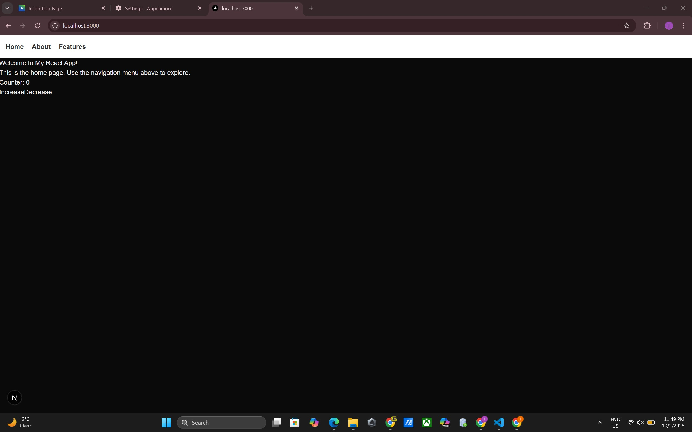

# Assignment 1 - Foundations of Advanced Front-End Development  

##  Overview  
This project is a simple **React + Next.js** web application that demonstrates core front-end concepts:  
- Component creation and props  
- State management across components  
- Event handling for user interactions  
- Conditional rendering based on state  
- Styling with **CSS and Tailwind**  

This application was built as part of **CPAN-144-0NB (Advanced Front-End Programming)**.  

---

##  Features  

###  Home Page (`/`)  
- Displays a welcome message.  
- Includes a **Counter component** with Increase/Decrease buttons (props + state + event handling).  

### ℹ About Page (`/about`)  
- Demonstrates **conditional rendering** using a ToggleMessage component.  
- Clicking the button shows/hides a message.  

###  Features Page (`/features`)  
- Demonstrates **event handling and forms** with a UserForm component.  
- User can type their name, submit, and see a personalized welcome message.  

---

## 🛠 Components  

- **Navbar** → Navigation menu (Home | About | Features).  
- **Counter** → Handles props, state, and event handling.  
- **ToggleMessage** → Demonstrates conditional rendering.  
- **UserForm** → Handles user input and form submission.  

---

##  Styling  

- Global styling with `globals.css` for dark theme background.  
- Tailwind CSS used for buttons, layout, and navigation.  
- Navbar styled with a white background and dark links for readability.  

---

##  Screenshots  

### Home Page
  

### About Page
  

### Features Page
  


## How to Run Locally  

1. Clone the repository:  
   ```bash
   git clone https://github.com/inder0121/assignment1-frontend.git
   cd assignment1-frontend
